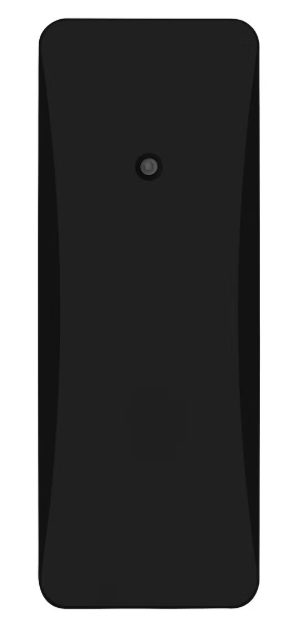
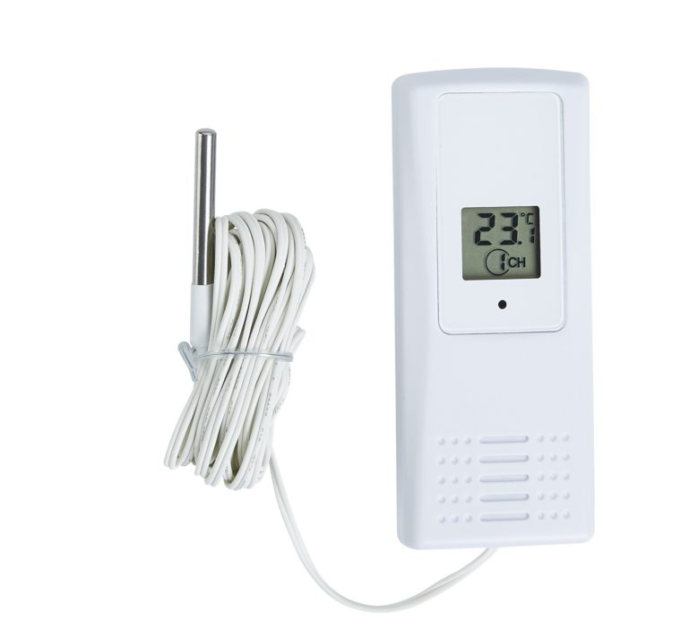

[Temperatures are tracked](/track-temperature) with [Clas Ohlson's](https://www.clasohlson.com/fi/Lampotila-anturi-kosteusmittari/p/36-6726-1)  and [Suomen Lämpömittari's](https://www.suomenlampomittari.fi/tuotteet/lahetin-mittarille-7410/) weather station sensors which send information with 433 MHz radio.

